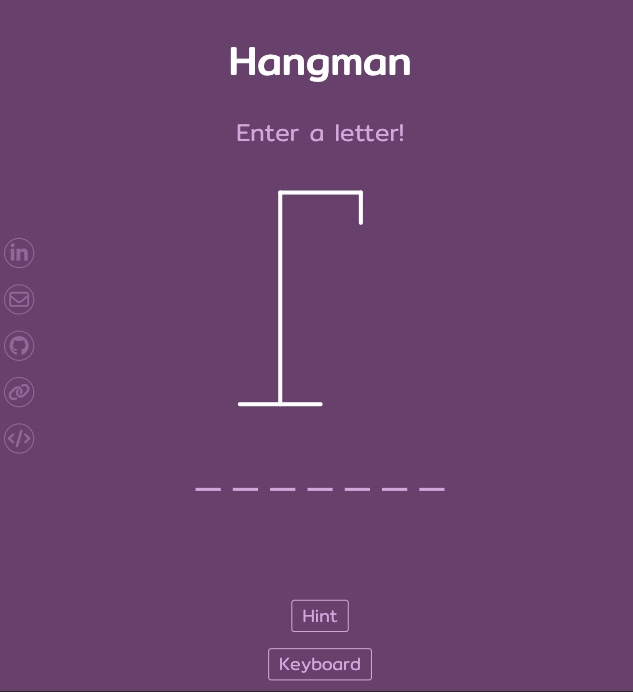
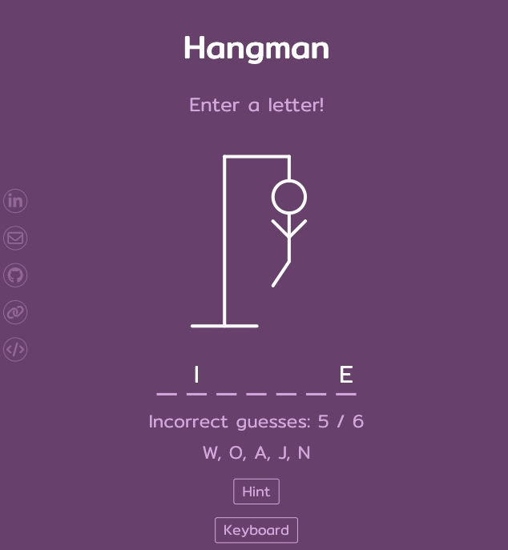
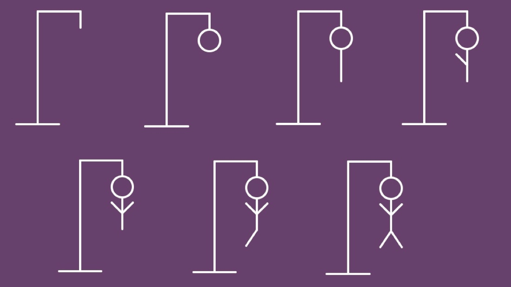
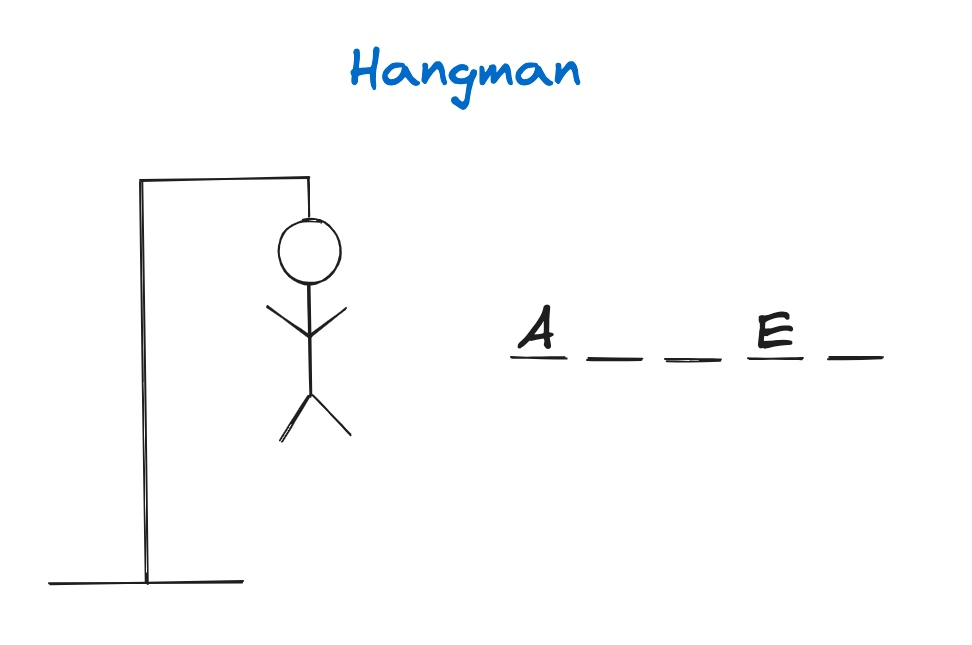

## Overview

1. [Description](#description)
2. [Deployment Link](#deployment-link)
3. [Installation](#installation)
4. [Technologies Used](#technologies)
5. [Deliverables](#deliverables)
6. [Planning/Build Process](#planning)
7. [Challenges](#challenges)
8. [Wins](#wins)
9. [Key Learnings & Takeaways](#takeaways)
10. [Future Improvements](#future-improvements)

---

## <a name="description"></a> 1. Description




I started this project in order to refamiliarise with JavaScript and React.js after taking a break to learn some other programming languages. I wanted to build an online version of the Hangman game where the player tries to guess the letters of an unknown random word.

The game is lost after 6 wrong guesses and won if all the letters of the random word are guessed correctly.

As letters in the word are guessed If a letter not in the word is guess, draw a figure part for each incorrect letter guess.

Each letter of the word is visually respresented with a dash when the player starts guessing which letters are in the word one at at a time.



If the player guesses a letter that is part of the answer, the letter appears above the corresponding dash. If the letter is not in the answer, a new body part of the stick figure is drawn attached to a scaffold.

The stick figure appears hanging from a scaffold in 6 different parts: head, body, left leg, right leg, left arm, right arm.
Keep guessing and adding body parts until the win by finishing the body or the guesser wins by completing the answer.

Draw part of the hangman when the players guess wrong.

Whenever a player guesses a letter that is not in the secret word, they get a strike that brings them closer to losing. To show this, the host draws a simple stick figure of a man being hung, adding a new part to the drawing with every wrong answer.

“head”“body.”
“arm.”
arm.
“leg.”
leg.

The players win when they guess the correct word. If the players get every letter of the word before the host finishes drawing then they win.

If the host ends up drawing the entire hangman, the players lose and the game is over.

The object of hangman is to guess the secret word before the stick figure is hung.

## <a name="deployment-link"></a> 2. Deployment link

http://hangman.katieloesch.co.uk

## <a name="installation"></a> 3. Installation

- package manager used: npm - v9.5.0
  - https://www.npmjs.com/package/npm
- to install dependencies, run:

```zsh
npm install
```

<br>

## <a name="technologies"></a> 4. Technologies Used

- This application is based in ReactJS (v18.2.0), JavaScript, JSX and SCSS.
  - it was created using the 'create-react-app' command
  - https://create-react-app.dev/

```zsh
npx create-react-app .
```

### UI

- fonts:
  - 'Mitr' designed by Cadson Demak
    - source: Font Squirrel
      - https://www.fontsquirrel.com/fonts/mitr
    - also available from Google Fonts:
      - https://fonts.google.com/specimen/Mitr
    - .woff files: assets/fonts directory
- icons:
  - iconify
    - https://icon-sets.iconify.design/
  - fontawesome
    - https://fontawesome.com/
- gifs:
  - [CodingNepal](https://www.youtube.com/redirect?event=video_description&redir_token=QUFFLUhqblN2dkhHdVRxemFLT2JSZVFIN204MTllZ0xqd3xBQ3Jtc0tsb0FNRWU5eVZyU0xfdnlkN2dfNWFoT1dfRllDY0IyLVpGcTd1bTVQVjY1MWJBMGFZWTdER1JVV1Q0WGN0S2hIdzZqa2ptQnQ3T09rN1J2NTJ0REhfNFJsTm9zUkRiRlh5bEt3djNhb0tHaUlyY2lnWQ&q=https%3A%2F%2Fcodingnepalweb.com%2Fcustom-projects%2Fhangman-game-images.zip&v=hSSdc8vKP1I)
- hangman svg:
  - https://github.com/bradtraversy/vanillawebprojects/blob/master/hangman/index.html
  - https://github.com/bradtraversy/vanillawebprojects/blob/master/hangman/style.css

### Additional tools used:

- Git / GitHub
  - used for version control
  - https://git-scm.com/
  - https://github.com/https://github.com/
- Visual Studio Code (VSCode)
  - code editor used for writing CSS, JSX, JavaScript and ruby.
- Google Chrome browser
  - used for launching the website and displaying the application Google Chrome
- Google Chrome Developer Tools: For troubleshooting and debugging
  - https://www.google.com/intl/en_uk/chrome/
- Hostinger: provider used to host portfolio website
  - https://www.hostinger.co.uk

### Tutorials and resources:

- YouTube: [Build Hangman With React](https://www.youtube.com/watch?v=jj0W8tYX_q8) by [Traversy Media](https://www.youtube.com/@TraversyMedia)
- YouTube: [This Is A Great Beginner React/TypeScript Project](https://www.youtube.com/watch?v=-ONUyenGnWw&t=2s) by [Web Dev Simplified](https://www.youtube.com/@WebDevSimplified)
- Youtube: [Build A Hangman Game in HTML CSS and JavaScript | Hangman Game in HTML CSS and JavaScript]() by [CodingNepal](https://www.youtube.com/@CodingNepal)

## <a name="deliverables"></a> 5. Deliverables

### MVP

- a working game hosted online
- a git repository hosted on Github, including:

  - a link to the hosted game
  - frequent commits dating back to the very beginning of the project
  - code that is well-formatted and well-commented
  - semantic markup for HTML and CSS while adhering to best practices

- a Hangman game with the following features:

  - pick a random word from a list of random words when the page loads
  - visually display a dash for each letters of the random word
  - if the player enters a letter that is in the random word, the dash should be replaced with the corresponding letter
  - if the player enters the same letter more than once they should be notified
  - if the player guesses all the letters of the words with 5 or less incorrect guesses, display a message to let the player know they've won
  - if the player makes 6 incorrect guesses display a message to let the player know they lost the game
  - for each wrong guess a new part of a Hangman figure appears on the screen and the 6th wrong guess completes the figure
  - after winning or losing a game the player can start a new game by clicking a button

- the website should also:
  - include contact information -> email, GitHub, Linkedin and other relevant links
  - be mobile responsive
  - adhere to KISS (Keep It Simple Stupid) and DRY (Don't Repeat Yourself) principles

### Stretch Goals

- option to display a hint
- different categories for random word
- animations
- sound effects
- enable user to mute sound effects

## <a name="planning"></a>6. Planning / Build Process

### User Stories

- As a user I should be able to enter letters to guess a random word.
- As a user I should be able to tell if my guess is correct or not.
- As a user I should be able to tell I should be notified if I entered the same letter more than once.
- As a user I should be able to tell if I've won the game or lost.
- As a user I should be able to start a new game.
- As a user I should be able to easily find contact information including email, linkedIn and GitHub accounts.
- As a user I should be able to navigate the website from any device.

This was a solo project I built over the course of 4 days.

### Day 1 - 22/01/2024

- create react app
- components
- wireframe



### Day 2 - 23/01/2024

- keyboard option in case user does not want to type
- CSS

### Day 3 - 24/01/2024

- add faded effect to keys already used
- media queries for modal
- contact icons to link to my github, portfolio, project code, linkedin, email

### Day 4 - 25/01/2024

- media queries
- deployment
- readme file

## 7. <a name="challenges"></a> Challenges

## 8. <a name="wins"></a> Wins

- fully responsive design

## <a name="takeaways"></a> 9. Key Learnings & Takeaways

## <a name="future-improvements"></a> 10. Future Improvements

- categories for the random word
- multi-player
- score board
- sound effects + animations
