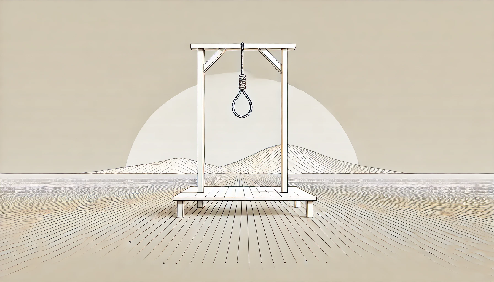
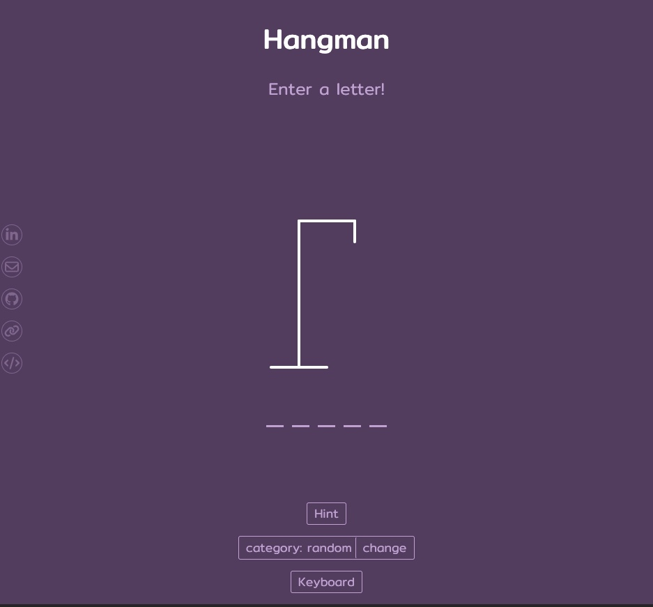

# Hangman in React



<sub>image source: generated using OpenAI's ChatGPT (via DALL-E)</sub>

## Overview

1. [Description](#description)
2. [Deployment Link](#deployment-link)
3. [Installation](#installation)
4. [Technologies Used](#technologies)
5. [Deliverables](#deliverables)
6. [Planning & Build Process](#planning)
7. [Challenges](#challenges)
8. [Wins](#wins)
9. [Key Learnings & Takeaways](#takeaways)
10. [Future Improvements](#future-improvements)

---

## <a name="description"></a> 1. Description

&nbsp;

I started this project to refamiliarise myself with JavaScript and React.js after taking a break to learn some other programming languages. I wanted to build an online version of the Hangman game where a player attempts to guess the letters of an unknown random word.
Each letter of the word is visually represented by a dash when the player starts guessing which letters are in the word, one at a time. If the player guesses a letter that is part of the answer, the letter appears above the corresponding dash. If the letter is not in the answer, a new part of a stick figure appears.

For each incorrect guess, a new part of the Hangman figure, attached to a scaffold appears on the screen. The stick figure shows up in 6 different parts:

1. head
2. body
3. left arm
4. right arm
5. left leg
6. right leg


The game is won if all the letters of the random word are guessed correctly before the Hangman figure is finished i.e. with less than 6 wrong guesses. The game is lost after 6 wrong guesses at which point the Hangman figure is completed. The object of the game is to guess the unknown word before the stick figure is hung.

## <a name="deployment-link"></a> 2. Deployment link

[]()

## <a name="installation"></a> 3. Installation

#### Package Manager: npm (v9.5.0)

- <sub>homepage: https://www.npmjs.com/</sub>
- <sub>GitHub repo: https://github.com/npm</sub>

#### Getting Started

- Ensure [Git](https://git-scm.com/) is installed on your machine.
- Clone the repository by running this command in your terminal:

```zsh
git clone https://github.com/katieloesch/hangman-react.git
```

- Navigate to the project directory to install dependencies:

```zsh
cd hangman-react
```

### Running the Application Locally in a local development environment:

**1. Install Dependencies**

- Run the following command in the project’s root directory to install all necessary dependencies:

```zsh
npm install
```

**2. Start the Development Server**

- After installing the dependencies, start the development server with:

```zsh
npm start
```

**3. Access the Application**

- The development server will start at `http://localhost:3000`.
- By default, your web browser should automatically open and navigate to this address.
- If it doesn’t, you can manually access the application by entering `http://localhost:3000` in any web browser.

## <a name="technologies"></a> 4. Technologies Used

### Core Technologies

- **ReactJS** (v18.3.1)

  - <sub>primary framework used to build the application</sub>
  - <sub>created using the create-react-app tool</sub>
  - <sub>React docs: https://reactjs.org/</sub>
  - <sub>Create React App docs: https://create-react-app.dev/</sub>

<br>

```zsh
npx create-react-app .
```

- **SCSS**
  - <sub>CSS preprocessor used for styling the application</sub>
  - <sub>docs: https://sass-lang.com/guide</sub>

### Key Dependencies

- **Sass** (v1.77.8)

  - <sub>CSS preprocessor used for styling the application</sub>
  - <sub>npm: https://www.npmjs.com/package/sass</sub>
  - <sub>GitHub repo: https://github.com/sass/dart-sass</sub>

### UI and Design

- **Fonts**
  - main font: \'Mitr\', designed by Cadson Demak
    - <sub>Font Squirrel: https://www.fontsquirrel.com/fonts/mitr</sub>
    - <sub>Google Fonts: https://fonts.google.com/specimen/Mitr</sub>
- **Icons**
  - **Iconify**
    - <sub>A free and open-source framework providing access to a vast number of icons, designed for use across various platforms and environments, including React.</sub>
    - <sub>homepage: https://icon-sets.iconify.design/</sub>
    - <sub>GitHub Repo: https://github.com/iconify/iconify/tree/main</sub>
    - <sub>license: https://github.com/iconify/iconify/blob/main/license.txt</sub>
  - **Font Awesome**
    - <sub>A popular icon library offering a large set of scalable and customizable icons, with a free version that is open source.</sub>
    - <sub>homepage: https://fontawesome.com/</sub>
    - <sub>GitHub repo: https://github.com/FortAwesome/Font-Awesome</sub>
    - <sub>license: https://fontawesome.com/license/free</sub>
- **Gifs**
  - **Coding Nepal**
    - <sub>website: [codingnepalweb.com](https://www.codingnepalweb.com/)</sub>
    - <sub>files: [youtube url](https://www.youtube.com/redirect?event=video_description&redir_token=QUFFLUhqblN2dkhHdVRxemFLT2JSZVFIN204MTllZ0xqd3xBQ3Jtc0tsb0FNRWU5eVZyU0xfdnlkN2dfNWFoT1dfRllDY0IyLVpGcTd1bTVQVjY1MWJBMGFZWTdER1JVV1Q0WGN0S2hIdzZqa2ptQnQ3T09rN1J2NTJ0REhfNFJsTm9zUkRiRlh5bEt3djNhb0tHaUlyY2lnWQ&q=https%3A%2F%2Fcodingnepalweb.com%2Fcustom-projects%2Fhangman-game-images.zip&v=hSSdc8vKP1I)</sub>
- **SVGs**
  - **Brad Traversy**
    - <sub>GitHub repo: https://github.com/bradtraversy/vanillawebprojects/tree/master/hangman</sub>
    - <sub>HTML: https://github.com/bradtraversy/vanillawebprojects/blob/master/hangman/index.</sub>
    - <sub>CSS: https://github.com/bradtraversy/vanillawebprojects/blob/master/hangman/style.css</sub>

### Development Tools

- **Git / GitHub**

  - <sub>used for version control and collaboration</sub>
  - <sub>Git: https://git-scm.com/</sub>
  - <sub>GitHub: https://github.com/</sub>

- **Visual Studio Code (VSCode)**

  - <sub>code editor used for development</sub>
  - <sub>homepage: https://code.visualstudio.com/</sub>
  - <sub>GitHub repo: https://github.com/microsoft/vscode</sub>

- **Google Chrome & Chrome DevTools**

  - <sub>used for testing, debugging, and developing in the browser</sub>
  - <sub>Google Chrome: https://www.google.com/chrome/</sub>
  - <sub>Chrome DevTools: https://developer.chrome.com/docs/devtools</sub>

- **Excalidraw**

  - <sub>tool used to create wireframes for the application</sub>
  - <sub>homepage: https://excalidraw.com/</sub>
  - <sub>GitHub repo: https://github.com/excalidraw/excalidraw</sub>

- **ChatGPT4o**:

  - <sub>generative AI tool used for debugging, development support and generating artwork for the README file.</sub>
  - <sub>homepage: https://chat.openai.com/</sub>
  - <sub>GitHub repo: https://github.com/openai</sub>

- **Hostinger**:
  - <sub>web hosting provider used to deploy the application</sub>
  - <sub>UK homepage: https://www.hostinger.co.uk</sub>

### Resources & Tutorials

- **YouTube**
  - <sub>[Build Hangman With React](https://www.youtube.com/watch?v=jj0W8tYX_q8) by [Traversy Media](https://www.youtube.com/@TraversyMedia)</sub>
  - <sub>[This Is A Great Beginner React/TypeScript Project](https://www.youtube.com/watch?v=-ONUyenGnWw&t=2s) by [Web Dev Simplified](https://www.youtube.com/@WebDevSimplified)</sub>
  - <sub>[Build A Hangman Game in HTML CSS and JavaScript | Hangman Game in HTML CSS and JavaScript](https://www.youtube.com/watch?app=desktop&v=hSSdc8vKP1I) by [CodingNepal](https://www.youtube.com/@CodingNepal)</sub>
- **List of random words by Coding Nepal**

  - <sub>Coding Nepal website: [codingnepalweb.com](https://www.codingnepalweb.com/)</sub>
  - <sub>list of random words: https://drive.google.com/file/d/1V3qIVPEtiJSlGEAqF_dMTF2HRGt_eq2U/view</sub>

## <a name="deliverables"></a> 5. Deliverables

### MVP (Minimum Viable Product)

- a working game hosted online
- a git repository hosted on Github, including:

  - a link to the hosted game
  - frequent commits dating back to the very beginning of the project
  - code that is well-formatted and well-commented
  - semantic markup for HTML and CSS while adhering to best practices
  - adherence to KISS (Keep It Simple Stupid) and DRY (Don't Repeat Yourself) principles

- a Hangman game with the following features:

  - selection of a random word from a list of random words when the page loads
  - visually display a dash for each letter of the random word
  - if the player enters a letter that is in the random word, that letter should appear above the corresponding dash or dashes
  - if the player enters the same letter more than once they should be notified
  - if the player guesses all the letters of the words with 5 or fewer incorrect guesses, a message should be displayed to let the player know they've won
  - if the player makes 6 incorrect guesses, a message should be displayed to let the player know they've lost the game
  - for each wrong guess a new part of a Hangman figure should appear on the screen and the 6th wrong guess completes the figure
  - after winning or losing a game the player can start a new game by clicking a button

- the website should also:
  - include contact information -> email, GitHub, LinkedIn and other relevant links
  - have a mobile-responsive design

### Potential Extra Features

- option to display a hint about the unknown random word
- different categories for random words for player to pick from
- animations
- sound effects
- scoreboard to keep track of wins and losses

### User Stories

- As a user, I should see a number of dashes corresponding to the letters of the random word I'm trying to guess.
- As a user, I should be able to enter letters to guess a random word.
- As a user, I should be able to tell if my guess is correct or not.
- As a user, I should see the correct letters guessed appear above the dashes on the screen.
- As a user, I should be able to see the incorrect letters I guessed appear on the screen separately from the correct letters.
- As a user, I should be notified if I enter the same letter more than once to guess the same word.
- As a user, I should be able to tell when I've won the game and when I've lost.
- As a user, I should be able to start a new game after winning or losing.
- As a user, I should have the option to get a hint about the random word I'm trying to guess.
- As a user, I should be able to easily find the developer's contact information including email, LinkedIn and GitHub accounts.
- As a user, I should be able to navigate the website from any device.

## <a name="planning"></a>6. Planning / Build Process

This was a solo project I built over the course of 5 days.

### Day 1 - 22/01/2024

I started this project by setting up a react app using the 'create-react-app' command.

```zsh
npx create-react-app .
```

After removing unnecessary files from the newly created project, I made a 'components' folder to store all the different react components needed for the game.

- header -> for the title and game instructions
- figure -> for the hangman figure
- hint -> for a hint about the random word that can be optionally displayed on the screen
- modal -> to notify the player when they win or lose the game
- notification -> to notify the player when they enter the same letter twice
- wrong letters -> to display the wrong letters guessed
- word -> to display the dashes and correct letters guessed
- contact icons -> to display links to LinkedIn/GitHub/portfolio/email

I also created a wireframe on Excalidraw to get an idea of the basic layout of the website.


### Day 2 - 23/01/2024

On the second day, I decided to add a keyboard component to the game to optionally display buttons for guessing letters in case the user doesn't want to type on their keyboard and would rather click on letter buttons on the screen.


I also worked on the modal notifying the player when they win or lose and started doing some styling for the different React components using SCSS.

### Day 3 - 24/01/2024

On the next day, I continued working on the keyboard because I wanted the buttons for the letters that had already been guessed to appear faded on the screen.


I achieved this by conditionally adding a class of 'faded' to each button. The className would be added to the button only if the letter on the button was included in the array of letters that were correct guesses or in the array of letters that were wrong guesses.

```JSX
<button className={`btn btn-letter ${(correctLetters.includes(letter.toLowerCase()) ||
                                      wrongLetters.includes(letter.toLowerCase()))
                                      && 'faded'}`}
                    key={`key-${index}`}
                    onClick={() => handleKeyClick(letter)}
 >
  {letter.toUpperCase()}
</button>

```

I then added a different styling for the keys that have the 'faded' class in the SCSS file to give them a more faded colour than the other keys.

```SCSS
 .btn-letter {

    background-color: rgb(97,69,106);
    border: 1px solid rgb(202, 171, 215);
    color: rgb(202, 171, 215);;

    &.faded {
        border: 1px solid rgb(120, 83, 132);
        color: rgb(120, 83, 132);
    }
  }
```

I also started writing media queries to make the website accessible from different devices and added the icons for my contact information linking to my:

- LinkedIn profile
- email address
- GitHub profile
- portfolio website
- this GitHub repository with the code for the game


### Day 4 - 25/01/2024

On day 4 I finished the remaining media queries for the responsive design and deployed the project using Hostinger. I also started writing the content for this readme.md file.

### Day 5 - 26/01/2024

On the final day working on this project, I finished writing the readme.md file and decided to add different categories the user can pick from when a random word is selected. I created new files for 3 additional categories:

- animals.js
- films.js
- cities.js

I used chatGTP to generate information to display as a hint for each word.<br>
(The api file I originally used (words.js) was not generated with chatGTP, it was downloaded from [codingNepal](https://drive.google.com/file/d/1V3qIVPEtiJSlGEAqF_dMTF2HRGt_eq2U/view))


<br>


## 7. <a name="challenges"></a> Challenges

## 8. <a name="wins"></a> Wins

- I aimed to complete this project within a 5-7 day window and successfully adhered to that timeline.
- I also managed to implement a fully responsive design and a keyboard with fading effect.

## <a name="takeaways"></a> 9. Key Learnings & Takeaways

## <a name="future-improvements"></a> 10. Future Improvements

- option for multiple players
- scoreboard to keep track of wins and losses
- sound effects + animations
