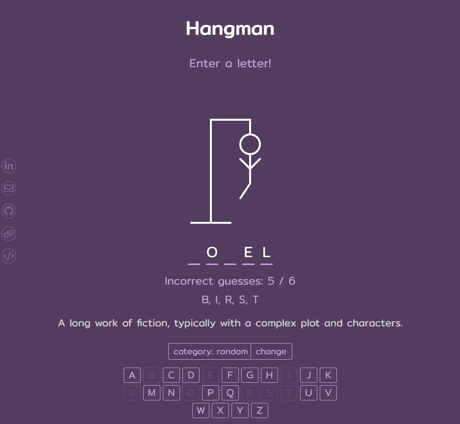

# Hangman in React


<sub>image source: generated using OpenAI's ChatGPT (via DALL-E)</sub>

## Overview

1. [Description](#description)
2. [Deployment Link](#deployment-link)
3. [Installation](#installation)
4. [Technologies Used](#technologies)
5. [Deliverables](#deliverables)
6. [Planning & Build Process](#planning)
7. [Challenges](#challenges)
8. [Wins](#wins)
9. [Key Learnings & Takeaways](#takeaways)
10. [Future Improvements](#future-improvements)

---

## <a name="description"></a> 1. Description

&nbsp;

A classic game of Hangman built in React.js. I started this project to reacquaint myself with JavaScript and React.js after taking a break to explore other programming languages. The goal was to build an online version of the classic Hangman game, where a player attempts to guess the letters of a randomly chosen word.

When the game begins, each letter of the word is represented by a dash. As the player guesses letters one by one, correct guesses reveal the corresponding letters above their respective dashes. Incorrect guesses result in a new part of a stick figure being drawn.

The Hangman figure is drawn in six stages, with each incorrect guess revealing the next part of the figure:

1. Head
2. Body
3. Left arm
4. Right arm
5. Left leg
6. Right leg


The game is won if the player successfully guesses all the letters in the word before the Hangman figure is fully drawn, meaning they have made fewer than six incorrect guesses. The game is lost if the player makes six incorrect guesses, at which point the Hangman figure is complete. The objective is to guess the unknown word before the stick figure is fully "hung."

## <a name="deployment-link"></a> 2. Deployment link

[]()

## <a name="installation"></a> 3. Installation

#### Package Manager: npm (v9.5.0)

- <sub>[website](https://www.npmjs.com/)</sub>
- <sub>[GitHub Repository](https://github.com/npm)</sub>

#### Getting Started

- Ensure [Git](https://git-scm.com/) is installed on your machine.
- Clone the repository by running this command in your terminal:

```zsh
git clone https://github.com/katieloesch/hangman-react.git
```

- Navigate to the project directory to install dependencies:

```zsh
cd hangman-react
```

### Running the Application Locally in a local development environment:

**1. Install Dependencies**

- Run the following command in the project’s root directory to install all necessary dependencies:

```zsh
npm install
```

**2. Start the Development Server**

- After installing the dependencies, start the development server with:

```zsh
npm start
```

**3. Access the Application**

- The development server will start at `http://localhost:3000`.
- By default, your web browser should automatically open and navigate to this address.
- If it doesn’t, you can manually access the application by entering `http://localhost:3000` in any web browser.

## <a name="technologies"></a> 4. Technologies Used

### Core Technologies

- **ReactJS** (v18.3.1)

  - <sub>primary framework used to build the application</sub>
  - <sub>created using the create-react-app tool</sub>
  - <sub>[React documentation](https://reactjs.org/)</sub>
  - <sub>[Create React App documentation](https://create-react-app.dev/)</sub>

<br>

```zsh
npx create-react-app .
```

- **SCSS**
  - <sub>CSS preprocessor used for styling the application</sub>
  - <sub>[SCSS documentation](https://sass-lang.com/guide)</sub>

### Key Dependencies

- **Sass** (v1.77.8)

  - <sub>CSS preprocessor used for styling the application</sub>
  - <sub>[npm page](https://www.npmjs.com/package/sass)</sub>
  - <sub>[GitHub repository](https://github.com/sass/dart-sass)</sub>

### UI and Design

- **Fonts**
  - main font: \'Mitr\', designed by Cadson Demak
    - <sub>[Font Squirrel](https://www.fontsquirrel.com/fonts/mitr)</sub>
    - <sub>[Google Fonts](https://fonts.google.com/specimen/Mitr)</sub>
- **Icons**
  - **Iconify**
    - <sub>A free and open-source framework providing access to a vast number of icons, designed for use across various platforms and environments, including React.</sub>
    - <sub>[website](https://icon-sets.iconify.design/)</sub>
    - <sub>[GitHub repository](https://github.com/iconify/iconify/tree/main)</sub>
    - <sub>[license](https://github.com/iconify/iconify/blob/main/license.txt)</sub>
  - **Font Awesome**
    - <sub>A popular icon library offering a large set of scalable and customizable icons, with a free version that is open source.</sub>
    - <sub>[website](https://fontawesome.com/)</sub>
    - <sub>[GitHub repository](https://github.com/FortAwesome/Font-Awesome)</sub>
    - <sub>[license](https://fontawesome.com/license/free)</sub>
- **Gifs**
  - **Coding Nepal**
    - <sub>[Coding Nepal website](https://www.codingnepalweb.com/)</sub>
    - <sub>[Gif files](https://www.youtube.com/redirect?event=video_description&redir_token=QUFFLUhqblN2dkhHdVRxemFLT2JSZVFIN204MTllZ0xqd3xBQ3Jtc0tsb0FNRWU5eVZyU0xfdnlkN2dfNWFoT1dfRllDY0IyLVpGcTd1bTVQVjY1MWJBMGFZWTdER1JVV1Q0WGN0S2hIdzZqa2ptQnQ3T09rN1J2NTJ0REhfNFJsTm9zUkRiRlh5bEt3djNhb0tHaUlyY2lnWQ&q=https%3A%2F%2Fcodingnepalweb.com%2Fcustom-projects%2Fhangman-game-images.zip&v=hSSdc8vKP1I)</sub>
- **SVGs**
  - **Brad Traversy**
    - <sub>[Traversy Media website](https://www.traversymedia.com/)</sub>
    - <sub>[GitHub repository](https://github.com/bradtraversy/vanillawebprojects/tree/master/hangman)</sub>
      - <sub>[HTML file](https://github.com/bradtraversy/vanillawebprojects/blob/master/hangman/index.)</sub>
      - <sub>[CSS file](https://github.com/bradtraversy/vanillawebprojects/blob/master/hangman/style.css)</sub>

### Development Tools

- **Git / GitHub**

  - <sub>used for version control and collaboration</sub>
  - <sub>[Git website](https://git-scm.com/)</sub>
  - <sub>[GitHub website](https://github.com/)</sub>

- **Visual Studio Code (VSCode)**

  - <sub>code editor used for development</sub>
  - <sub>[website](https://code.visualstudio.com/)</sub>
  - <sub>[GitHub repository](https://github.com/microsoft/vscode)</sub>

- **Google Chrome & Chrome DevTools**

  - <sub>used for testing, debugging, and developing in the browser</sub>
  - <sub>[Google Chrome website](https://www.google.com/chrome/)</sub>
  - <sub>[Chrome DevTools documentation](https://developer.chrome.com/docs/devtools)</sub>

- **Excalidraw**

  - <sub>tool used to create wireframes for the application</sub>
  - <sub>[website](https://excalidraw.com/)</sub>
  - <sub>[GitHub repository](https://github.com/excalidraw/excalidraw)</sub>

- **ChatGPT4o**:

  - <sub>generative AI tool used for debugging, development support and generating artwork for the README file</sub>
  - <sub>[website](https://chat.openai.com/)</sub>
  - <sub>[GitHub repository](https://github.com/openai)</sub>

- **Hostinger**:
  - <sub>web hosting provider used to deploy the application</sub>
  - <sub>[UK website](https://www.hostinger.co.uk)</sub>

### Resources & Tutorials

- **YouTube**
  - <sub>[Build Hangman With React](https://www.youtube.com/watch?v=jj0W8tYX_q8) by [Traversy Media](https://www.youtube.com/@TraversyMedia)</sub>
  - <sub>[This Is A Great Beginner React/TypeScript Project](https://www.youtube.com/watch?v=-ONUyenGnWw&t=2s) by [Web Dev Simplified](https://www.youtube.com/@WebDevSimplified)</sub>
  - <sub>[Build A Hangman Game in HTML CSS and JavaScript | Hangman Game in HTML CSS and JavaScript](https://www.youtube.com/watch?app=desktop&v=hSSdc8vKP1I) by [CodingNepal](https://www.youtube.com/@CodingNepal)</sub>
- **List of random words by Coding Nepal**

  - <sub>[Coding Nepal website](https://www.codingnepalweb.com/)</sub>
  - <sub>[list of random words](https://drive.google.com/file/d/1V3qIVPEtiJSlGEAqF_dMTF2HRGt_eq2U/view)</sub>

## <a name="deliverables"></a> 5. Deliverables

### MVP (Minimum Viable Product)

- a working game hosted online
  - the game should be accessible via a public URL
- a Git Repository Hosted on GitHub, including:
  - a link to the hosted game
  - frequent commits, documenting the project's progress from the beginning
  - well-formatted and well-commented cod
  - semantic HTML and CSS, adhering to best practices
  - adherence to KISS (Keep It Simple, Stupid) and DRY (Don't Repeat Yourself) principles
- Hangman game features:
  - A random word is selected from a predefined list when the page loads.
  - A dash is displayed for each letter of the random word.
  - When the player guesses a letter that is part of the word, the letter appears above the corresponding dash(es).
  - If the player enters the same letter more than once, they are notified.
  - If the player correctly guesses all letters with 5 or fewer incorrect guesses, a victory message is displayed.
  - If the player makes 6 incorrect guesses, a loss message is displayed.
  - With each incorrect guess, a new part of the Hangman figure appears on the screen, with the 6th incorrect guess completing the figure.
  - After winning or losing, the player can start a new game by clicking a button.
- website requirements:
  - includes contact information: email, GitHub, LinkedIn, and other relevant links
  - features a mobile-responsive design

### Potential Extra Features

- option to display a hint about the unknown word
- different categories for random words, allowing the player to choose
- animations to enhance gameplay
- sound effects to provide audio feedback
- a scoreboard to keep track of wins and losses

## <a name="planning"></a>6. Planning / Build Process

This was a solo project that I developed over the course of 5 days.

### User Stories

- As a user, I want to see a series of dashes that correspond to the letters of the random word I'm trying to guess.
- As a user, I want to enter letters to guess the random word.
- As a user, I want to know if my guess is correct or not.
- As a user, I want to see correct guesses appear above the corresponding dashes on the screen.
- As a user, I want incorrect guesses to be displayed separately from the correct guesses.
- As a user, I want to be notified if I enter the same letter more than once while guessing the same word.
- As a user, I want to know when I've won or lost the game.
- As a user, I want to be able to start a new game after winning or losing.
- As a user, I want the option to get a hint about the random word I'm trying to guess.
- As a user, I want to easily find the developer's contact information, including email, LinkedIn, and GitHub accounts.
- As a user, I want to navigate the website easily from any device.

### Day 1 - 22/01/2024

I began the project by setting up a React app using the create-react-app command:

```zsh
npx create-react-app .
```

After removing unnecessary files from the newly created project, I created a components folder to store all the React components needed for the game:

- Header: for the title and game instructions
- Figure: for the Hangman figure
- Hint: for an optional hint about the random word displayed on the screen
- Modal: to notify the player when they win or lose the game
- Notification: to alert the player when they enter the same letter twice
- Wrong Letters: to display the incorrect letters guessed
- Word: to display the dashes and correct letters guessed
- Contact Icons: to display links to LinkedIn, GitHub, portfolio, and email

I also created a wireframe using [Excalidraw](https://excalidraw.com/) to visualize the basic layout of the website:

<br>


### Day 2 - 23/01/2024

On the second day, I decided to add a keyboard component to the game, allowing users to guess letters by clicking on-screen buttons instead of typing.


I also worked on the modal that notifies players when they win or lose and began styling the various React components using SCSS.

### Day 3 - 24/01/2024

The next day, I continued working on the keyboard component. I wanted the buttons for guessed letters to appear faded on the screen.


I achieved this by conditionally adding a class of faded to each button. The class is applied only if the letter on the button is included in either the array of correct guesses or the array of wrong guesses.

```JSX
<button className={`btn btn-letter ${(correctLetters.includes(letter.toLowerCase()) ||
                                      wrongLetters.includes(letter.toLowerCase()))
                                      && 'faded'}`}
                    key={`key-${index}`}
                    onClick={() => handleKeyClick(letter)}
 >
  {letter.toUpperCase()}
</button>

```

I then added styling for the faded class in the SCSS file to give the keys a more subdued color.

```SCSS
 .btn-letter {

    background-color: rgb(97,69,106);
    border: 1px solid rgb(202, 171, 215);
    color: rgb(202, 171, 215);;

    &.faded {
        border: 1px solid rgb(120, 83, 132);
        color: rgb(120, 83, 132);
    }
  }
```

I also started writing media queries to make the website accessible on different devices and added icons for my contact information, linking to:

- LinkedIn profile
- Email address
- GitHub profile
- Portfolio website
- This GitHub repository containing the game’s code

<br>


### Day 4 - 25/01/2024

On day 4, I completed the remaining media queries for responsive design and deployed the project using Hostinger. I also started drafting the content for this README file.

### Day 5 - 26/01/2024

On the final day, I completed the README file and added different categories from which the user can select a random word. I created new files for three additional categories:

- animals.js
- films.js
- cities.js

I used [ChatGPT](https://chat.openai.com/) to generate information for the hints provided for each word.<br>
(Note: The API file I originally used (words.js) was not generated by ChatGPT; it was downloaded from [CodingNepal](https://drive.google.com/file/d/1V3qIVPEtiJSlGEAqF_dMTF2HRGt_eq2U/view)).


<br>


## 7. <a name="challenges"></a> Challenges

## 8. <a name="wins"></a> Wins

- I aimed to complete this project within a 5-7 day window and successfully adhered to that timeline.
- I also managed to implement a fully responsive design and a keyboard with fading effect.

## <a name="takeaways"></a> 9. Key Learnings & Takeaways

## <a name="future-improvements"></a> 10. Future Improvements

- option for multiple players
- scoreboard to keep track of wins and losses
- sound effects + animations
